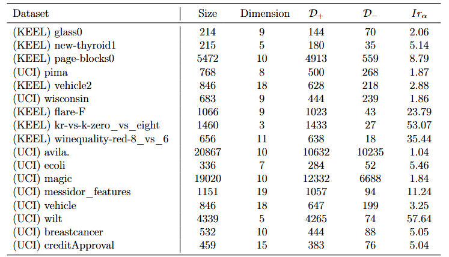
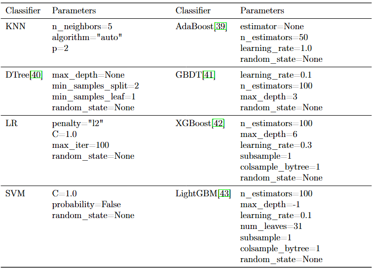
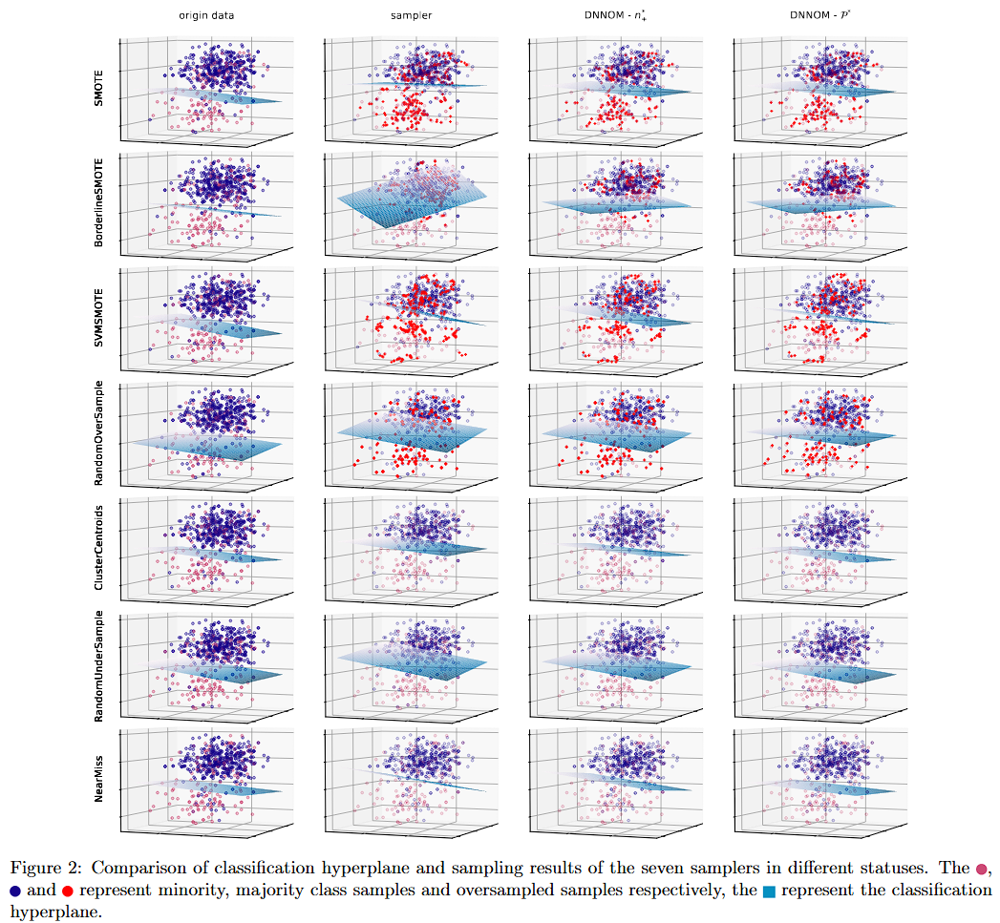
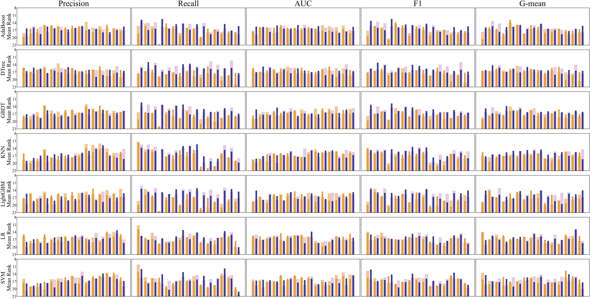
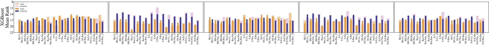

# DNNOM: A Hybrid-Sampling Optimization Framework

Official implementation of the paper:  **"DNNOM: A Hybrid-Sampling Optimization Framework Comprising Dual Nonconvex and Nonsmooth Optimization Models for Imbalanced Noise Classification"** .


## 📖 Overview

**DNNOM** (Dual Nonconvex and Nonsmooth Optimization Models) is a robust hybrid-sampling framework designed to tackle the joint challenge of **class imbalance** and  **label noise** . Unlike traditional heuristic resampling (like SMOTE or Random Undersampling), DNNOM treats sampling as a formal optimization problem. The flowchart for **DNNOM** is as follows.


## ✨ Key Features

- Supports multiple sampling strategies:

  - Oversampling: SMOTE, BorderlineSMOTE, SVMSMOTE, RandomOverSampler, SMOTEN
  - Undersampling: RandomUnderSampler, NearMiss, ClusterCentroids
- Plug-and-play **DNNOM framework** for distribution regularization
- Compatible with various classifiers:

  - AdaBoost, DTree, GBDT, KNN, LR, SVM, LightGBM, XGBoost
- Complete ablation experiment visualization, comparative trials, and Friedman statistical experiments

**Key Contributions:**

1) We propose an optimization model for binary classification hybrid-sampling. By jointly optimizing the quantities of undersampling and oversampling, it achieves an optimal balance between majority and minority class, transforming the hybrid-sampling problem into a solvable convex optimization problem.
2) item To derive theoretically optimal undersampling and oversampling rates, we combine information theory with probability distribution divergence (e.g. KL divergence). We design objective and constraint functions based on data complexity and class overlap, constructing a convex optimization model whose optimal solution existence and uniqueness are proven.
3) To mitigate the impact of noisy samples and ensure synthetic samples closely approach the safety region of minority class, we propose an adaptive feature optimization model. By maximizing the KL divergence between the probability distributions of original features and sampled samples, we compute the optimal location for new samples. This effectively alleviates noise and boundary blurring issues introduced by random sampling.
4) Comparative experiments across dozens of public datasets and varying noise settings against multiple mainstream sampling methods and frameworks demonstrate that the proposed optimization framework outperforms existing approaches in both classification performance and robustness, while exhibiting strong generalization capabilities and classifier independence.

## 📂 Project Structure
├── figs/

│      ├── classifier_para.png

│      ├── comparison.png

│      ├── dataset_info.png

│      ├── flowchart.png

│      ├── friedman1.png

│      ├── friedman1_1.png

│      ├── friedman2.png

│      ├── friedman2_2.png

│      ├── sampler_para.png

│      └── visual.png

├── __api_experiments.cpython-38.pyc

├── _api_DNNOM_BU.cpython-38.pyc

├── api.cpython-38.pyc

├── api_GB.cpython-38.pyc

├── api_OBHRF.cpython-38.pyc

├── DNNOM_BH.cpython-38.pyc

├── DNNOM_BO.cpython-38.pyc

├── draw_BH.cpython-38.pyc

├── draw_functions_OBHRF.cpython-38.pyc

├── friedman.cpython-38.pyc

├── NaN.cpython-38.pyc

├── requirements.txt

└── RSDS.cpython-38.pyc


## 🛠️ Installation

```bash
# Clone the repository
git clone https://github.com/xyzhou1534/DNNOM.git
cd DNNOM

# Install dependencies
pip install -r requirements.txt
```

## 🧪 Experimental Settings

The performance of **DNNOM** for classification is evaluated and compare with currently available resamplers, as well as without any resampling. This section conducts simulation experiments under the following experimental settings. Moreover, all experiments are conducted on a Ubuntu 22.04 with an Intel e5-1650v4 CPU and $32$ GB of RAM.

**Datasets:** All actual datasets were obtained from the UCI (https://archive.ics.uci.edu/datasets) and KEEL (http://sci2s.ugr.es/keel/imbalanced.php) library. **DNNOM** focuses on binary classification tasks, thus employing the OVR method to convert multiclass datasets into binary formats. Experiments encompassed multiple datasets with varying sample sizes from small to large, dimensions from low to high and imbalance rates from low to high. Detailed dataset information is asfollows.



The parameters of the sampler and classifier used in the experiment are as follows.


Information of sampler parameters.



Information of Classifier parameters.

## 📊 Experimental Results

- The ablation experiment for **DNNOM** is visualized as follows.

  
- The comparative trial of DNNOM is as follows: Average results based on 17 datasets, 8 classifier, 5 metrics, and 15 samplers at η ∈ {0.05, 0.15, 0.25, 0.35, 0.45} (Each numerical result is presented as"mean"±"variance". The "↑" indicates that a larger value of a metric is better. Performance improvements achieved by the DNNOM framework are highlighted in green. For each metric at different η, the worst value in a column is marked in yellow while the best value is marked in red, both colors will overlay the green.

  
- Friedman statistical experiment for DNNOM is as follows.

  

  

  The mean rank of evaluated classifiers for different metrics at η = 0.15 & 0.25. (The light red and light blue represent the original sampling algorithm and the DNNOM framework’s optimized mean ranking at η = 0.15 respectively. Similarly, the dark red and dark blue represent the mean ranking at η = 0.25 respectively.)





The mean rank of evaluated classifiers for different metrics at η = 0.15 & 0.25. (The light yellow and light purple represent the original sampling algorithm and the DNNOM framework’s optimized mean ranking at η = 0.15 respectively. Similarly, the dark yellow and dark purple represent the mean ranking at η = 0.25 respectively.)

## 🎓 Citation

If you find this work helpful in your research, please cite:

```
@article{yourname2026dnnom,
  title={DNNOM: A Hybrid-Sampling Optimization Framework Comprising Dual Nonconvex and Nonsmooth Optimization Models for Imbalanced Noise Classification},
  author={X. Zhou and H. Zhou},
  journal={Knowl.-Based Syst.},
  year={2026}
}
```

## 🔔 Notice
To ensure academic fairness and impartiality, we have encrypted the critical code segments. 
The complete code will be made publicly available upon acceptance of the paper. 
For any inquiries, please contact xyzhou1534@gamil.com.

---
